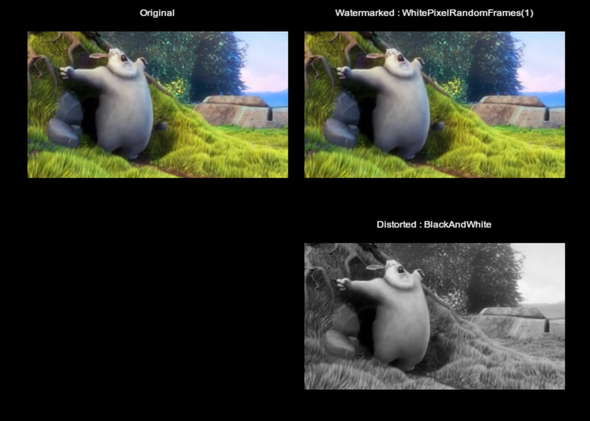
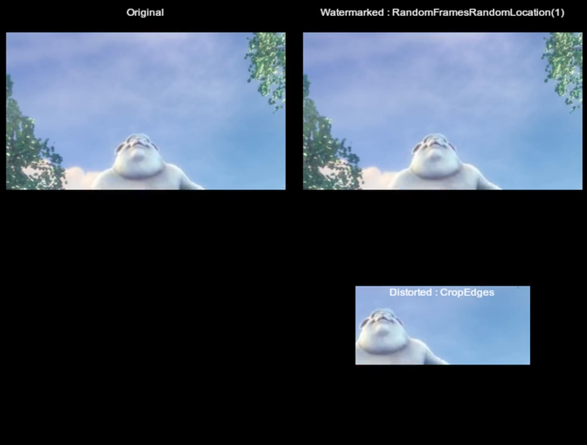
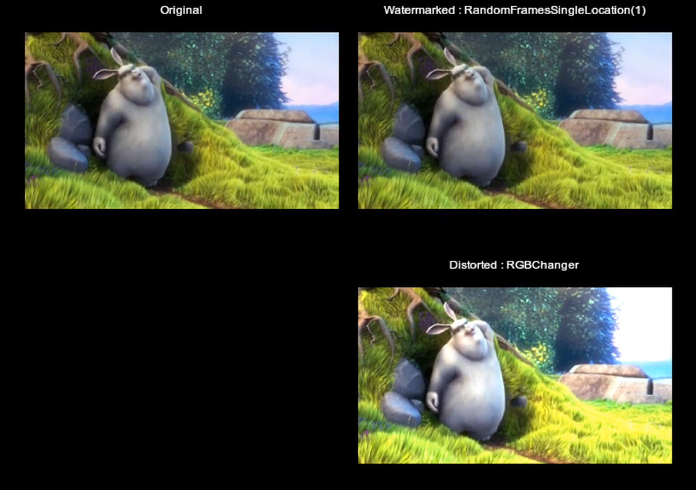

This project aims to enable people to add an digital watermark to a video as a proof of ownership using different algorithms. Also this project provides tools to test durability of the digital watermark against various types of attacks.

This project is beeing done as the final project of Boğaziçi University - Software Engineering Department. 

Requirements
============

* Python 2.7+

Installation
============

::

	pip install -r requirements.txt

Usage
=====

Project aims to add digital watermark to a given video. There are two main functionality; Watermarking and dewatermarking.

Watermarking
------------

Watermarking is done by hiding a given text to the video. In order to prevent passive attacks (attacker who are trying to retrieve the watermark from the video), a password should be provided with watermarking. This password will be used when video is dewatermarked. An example of watermarking is given below;

::

	python VideoWatermarker.py 
		--video=input.mp4  
		--workplace=/tmp/workplace 
		--output=watermarked.mp4 
		--watermark_algorithm=RandomFramesRandomLocation 
		--watermark_algorithm_aggressiveness=75 
		--message=property_of_bahadir_ozavci 
		--password=dontstealmyvideo 
		--verbose=False

--video 	Relative path of the video to be watermarked
--workplace 	Path of directory to create temporary files ( Default is /tmp/video_watermarker/ )
--output	Relative path of the watermarked output video
--watermark_algorithm 	An enum of one of the watermarking algorithms available. ( See Watermarking Algorithms section )
--watermark_algorithm_aggressiveness	Number between 0 - 100 to spesify the agressiveness of the watermarking algorithm (See Watermarking Algorithms section)
--message	Text message to be hidden in the video as watermark
--password 	Text password to be used during dewatermarking
--verbose 	Boolean value to retrieve detailed logs about the process
	

Dewatermarking
------------

Text that is hidden in a video with one of algorithms implemented can be extracted by supplying the algorithm used and the password given  during the watermarking. Output is the 

::

	python VideoDewatermarker.py 
		--video=watermarked.mp4 
	        --workplace=/tmp/workplace
	        --watermark_algorithm=RandomFramesRandomLocation 
	        --password=dontstealmyvideo

--video 	Relative path of the video that was watermarked
--workplace 	Path of directory to create temporary files ( Default is /tmp/video_watermarker/ )
--watermark_algorithm 	An enum of one of the watermarking algorithms available. ( See Watermarking Algorithms section )
--password 	Password that was used during the watermarking

Output: 
::

	property_of_bahadir_ozavci

Watermarking Algorithms
-----------------------

* **SingleFrameRandomLocation** : Selects a single random frame from the given video. At that frame selects a random location (x, y) at frame. Embeds the charachters of message at the red value of the pixels in order.

* **RandomFramesSingleLocation** : Selects multiple random frames from the given video. At each frame selects a predefined location (x, y) at frame. Embeds the charachters of message at the red value of the pixels in order.

* **RandomFramesRandomLocation** : Selects multiple random frames from the given video. At each frame selects a random location (x, y) at frame. Embeds the charachters of message at the red value of the pixels in order.

* **BlackPixelRandomFrames** : Selects multiple random frames from the given video. At each frame, first every black pixel on that frame is distorted to a very dark gray. Later selects random location and puts a black pixel to spesify the start point. After the the start point, at each row there should be a single black pixel. That black pixel's column distance to the start point states the characahter in integer value. Characters are appended until there are no black pixels.

* **WhitePixelRandomFrames** : Selects multiple random frames from the given video. At each frame, first every white pixel on that frame is distorted to a very light gray. Later selects random location and puts a white pixel to spesify the start point. After the the start point, at each row there should be a single white pixel. That white pixel's column distance to the start point states the characahter in integer value. Characters are appended until there are no white pixels.

Attacking the Video
-------------------

Malious attacks to the video may be applied to the video in order to make watermark unextractable. These attacks can be simulated using following command.

::

	python VideoDistorter.py 
		--video=watermarked.mp4 
	        --workplace=/tmp/workplace
	       	--output=distorted.mp4 
	        --distortion_algorithms=CropEdges 
		--verbose=False

--video 	Relative path of the video that was watermarked
--workplace 	Path of directory to create temporary files ( Default is /tmp/video_watermarker/ )
--output 	Relative path of the distrorted output video
--distortion_algorithms 	An enum of one of the distortion algorithms available. ( See Distortion Algorithms section )
--verbose 	Boolean value to retrieve detailed logs about the process

Distortion Algorithms
-----------------------

* **CropEdges**  : Crops the edges of the video by 120px from each side
* **RGBChanger** : Randomly changes the colors of the video
* **BlackAndWhite** : Converts the video to a Black & White 

Testing
============

Testing different watermarking algorithms and running attacks on these watermarked videos can be using WatermarkingTester utility. This utility will watermark a given video with a random string, and run multiple distrortion algorithms against the watermarked video to test if watermark is lost after distortion. 

Also this utility creates a video of original video, watermarked video and distorted video to make visual comparison.

::

	python WatermarkingTester.py 
		--video=input.mp4
		--workplace=/tmp/workplace
		--watermark_algorithm=WhitePixelRandomFrames
		--watermark_algorithm_aggressiveness=30
		--distortion_algorithms=BlackAndWhite
		--comparison_output=comparison.mp4

--video 	Relative path of the video that was watermarked and dewatermark
--workplace 	Path of directory to create temporary files ( Default is /tmp/video_watermarker/ )
--watermark_algorithm 	An enum of one of the watermarking algorithms available. ( See Watermarking Algorithms section )
--watermark_algorithm_aggressiveness	Number between 0 - 100 to spesify the agressiveness of the watermarking algorithm (See Watermarking Algorithms section)
--distortion_algorithms 	An enum of one of the distortion algorithms available. ( See Distortion Algorithms section )
--comparison_output 	Relative path of the comparison video

Output:

::

	[WatermarkingTester] >>>> Started watermarking 
	100%|██████████| 303/303 [00:01<00:00, 251.79it/s]
	100%|██████████| 206/206 [00:02<00:00, 100.34it/s]
	[WatermarkingTester] >>>> Started dewatermarking
	[WatermarkingTester] >>>> Watermarking succeeded.
	[WatermarkingTester] >>>> Starting distortion
	100%|██████████| 303/303 [00:01<00:00, 237.59it/s]
	100%|██████████| 207/207 [00:03<00:00, 73.25it/s]
	[WatermarkingTester] >>>> Distortion completed
	[WatermarkingTester] >>>> Dewatermarking on distorted video
	[WatermarkingTester] >>>> Watermark not lost on distorted Video
	[WatermarkingTester] >>>> Creating comparison video
	100%|██████████| 305/305 [00:01<00:00, 227.40it/s]
	100%|█████████▉| 207/208 [00:19<00:00, 10.40it/s]
	[WatermarkingTester] >>>> Comparison video created!

    Comparison video of a test with WhitePixelRandomFrames watermarking algorithm against BlackAndWhite distortion algotihm

    Comparison video of a test with RandomFramesRandomLocation watermarking algorithm against CropEdges distortion algotihm

    Comparison video of a test with RandomFramesSingleLocation watermarking algorithm against RGBChanger distortion algotihm

